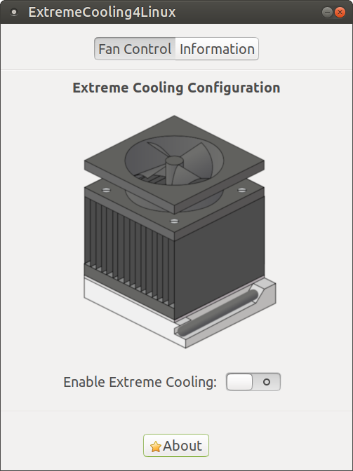

# BatteryOptimizer

BatteryOptimizer is a Gtk3 program to enable the extreme cooling fan mode on Linux.

Extreme cooling is a special fan mode supported in Lenovo Legion laptops. This mode can
increase the cooling performance of your laptop and reduces its temperature.  However, this feature
is only supported by Lenovo through its Windows  program Lenovo Sense Nerve. 

BatteryOptimizer has been created to enable  and support this special feature on Linux. Currently 
is only tested in Lenovo Legion Y520, but it should be work in other models like Lenovo Legion Y720. 

## Warning

This program does not have warranty and only use at your own risk. Enable extreme cooling only in short periods of time as it can 
reduce the lifespan of your fans and do not use in laptops without extreme cooling support from Lenovo.

## Published on Itch.io and AUR

BatteryOptimizer is available as AppImage and deb package in https://odintdh.itch.io/extremecooling4linux

If you use an Arch based distribution you can install BatteryOptimizer from AUR in https://aur.archlinux.org/packages/extremecooling4linux/

## Desktop applet

you can use BatteryOptimizer from a desktop applet with [indicator-extremecooling4linux](https://gitlab.com/OdinTdh/indicator-extremecooling4linux) 

## Dependencies

The AppImage package has all dependencies included, so if you download it, you don't need to install 
dependencies. However, if you prefer execute it from source code you have to install python 3 
and the following packages: 

* python3-gi
* python3-gi-cairo
* gir1.2-gtk-3.0
* python3-portio.

## Installation

There are 4 options to install BatteryOptimizer. You only need to use one of them.

* AppImage
* Deb package
* Source
* AUR

If you use the AppImage version you don't need install it only you have to download it from [itch.io](https://odintdh.itch.io/extremecooling4linux)
and give it permission to execute with the **chmod** command.

To install the deb package you can use the **dpkg -i** command or a gui program to install deb packages like **GDebi**.

If you use Arch you can install from AUR with an AUR helper like **yay**. 

If you want install from the source you can install it with the following command:

    sudo make install
    
To uninstall:

    sudo make uninstall  

## Usage

BatteryOptimizer needs root privileges to configure and enable extreme cooling when you execute it with the AppImage 
version. If you use the **deb** version or install it from the source with the **make** command, you don't need to execute
it with sudo to get root permissions as it installs a polkit policy to avoid ask root password.

If you use the BatteryOptimizer appimage from [itch.io](https://odintdh.itch.io/extremecooling4linux), you have 
to execute with sudo to enable extreme cooling.

If you installed BatteryOptimizer from a deb package or the source code, you can execute it from the
menu of your desktop or from the console with the **ec4Linux** command.
 
BatteryOptimizer works as a gui program but also it has command line interface with the following options:

* enable: starts extreme cooling fan mode
* disable: stop extreme cooling fan mode
* change-state: change the state of the fan mode from enable/disable to disable/enable states.

### Examples:

Start extreme cooling fan mode
    
    ec4Linux enable
    
Stop extreme cooling fan mode

    ec4Linux disable
   
Start extreme cooling fan mode if it is stopped:

    ec4Linux change-state

Stop extreme cooling fan mode if it is started:

    ec4Linux change-state

## Supported laptop models

Currently BatteryOptimizer is only tested in the Lenovo Legion Y520 laptop, but it should be work 
in other models with extreme cooling supported by Lenovo like Lenovo Legion Y720.

## How to collaborate

BatteryOptimizer only works in Lenovo laptops with extreme cooling support by Lenovo but only I can test in my own
laptop. It would be great to have a complete list with the models that supports Lenovo extreme cooling. If your laptop
supports Lenovo extreme cooling, please send an [issue](https://gitlab.com/OdinTdh/extremecooling4linux/issues) with the output of these commands to get the system information
of your laptop model:
 
 **sudo dmidecode -s system-manufacturer && sudo dmidecode -s system-version &&  sudo dmidecode -s system-product-name**

The output of these commands in my laptop is:
**LENOVO
Lenovo Y520-15IKBN
80WK**

## Screenshots

## License

BatteryOptimizer is published under GPLv3
